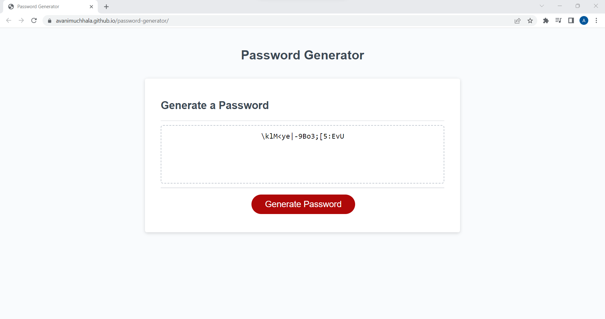

# Password Generator

## Description

This password generator creates a strong and secure password that meets certain criteria that is selected by the user. Through a series of prompts, the user can input the password length and choose whether to include lowercase, uppercase, numeric, and/or special characters in the password. This was built to allow people to randomly generate a strong password that they can then use when they need to access personal or sensitive data. This project was done to practice the basics of JavaScript.

## Usage

Click on Website URL: https://avanimuchhala.github.io/password-generator/

Once on the website, click on the red button titled "Generate Password" to get started. Follow the window prompts as they appear. You will first be asked to input the number of characters you want in your password. You will then be asked to confirm which character types to include (press "OK" to confirm, press "Cancel" to not include). At least one character type must be confirmed. Once the criteria has been selected, the characters of those selected types will be randomly generated. The resulting password will appear on the screen which can then be copied for later usage. 

Below is a screenshot showing the web application's appearance and functionality: 

## License

MIT License. Please refer to the LICENSE in the repo.

## How to Contribute

If you would like to contribute to this project, please email me at: avani.muchhala@case.edu.